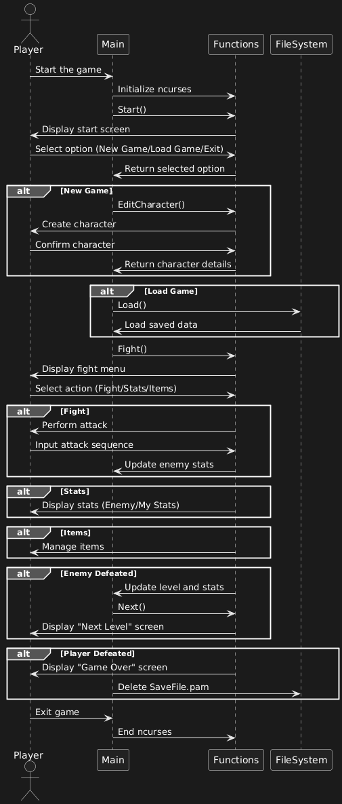

# Technical Overview of the Program

## Program Description
The program is a text-based game written in the C programming language. It utilizes the `ncurses` library to create an interactive user interface in the terminal. The main components of the program include:

### 1. Main Game Loop (`main.c`)
- Initializes the `ncurses` environment.
- Allocates memory for the player's character and sets default values.
- Loads a list of items from the `items` file.
- Processes player input to decide whether to:
  - Start a new game,
  - Load a saved game, or
  - Exit the program.
- Calls functions for character editing, combat, and game saving.

### 2. Character and Enemy Management (`functions.c`)
- **Character Editing**: Allows the player to modify character attributes such as health, attack, and defense.
- **Combat System**: Implements turn-based combat where the player can:
  - Attack,
  - Use items, or
  - View statistics.
- **Item Management**: Enables the player to pick up and use items that affect character attributes.

### 3. Saving and Loading the Game (`functions.c`)
- **Save Function**: Saves the current game state to a file named `SaveFile.pam`.
- **Load Function**: Loads a saved game state from the file.

### 4. User Interaction (`ncurses`)
- The program uses windows and color schemes to display menus, statistics, and the combat system.
- Player input is handled via keyboard shortcuts.

## Data Structures
- **`node_t`**: Represents the player and enemies as a linked list.
- **`item_t`**: Represents items that the player can collect and use.

## Interaction Between Components
- The main game loop (`main.c`) calls functions from `functions.c` to handle various parts of the game.
- Save and load functions interact with files (`SaveFile.pam` and `items`) to persist and retrieve game states.
- The combat system uses the linked list (`node_t`) to manage enemies and the player.
- Item management works with an array of `item_t` structures to handle the player's inventory.

## File Structure
- **`main.c`**: Contains the main game loop and high-level game logic.
- **`functions.c`**: Implements character management, combat, and save/load functionality.
- **`items`**: A file containing the list of items available in the game.
- **`SaveFile.pam`**: A file used to save and load the game state.

## Dependencies
- The program requires the `ncurses` library to run. Ensure it is installed on your system before compiling the program.

## Sequence Diagram
Below is a sequence diagram illustrating the interaction between the main components of the program:

## Sources
- man pages in Ubuntu Linux
- [GeeksForGeeks.org](https://www.geeksforgeeks.org/)
- [DLABAL, Eduard](https://dlabal.xyz)